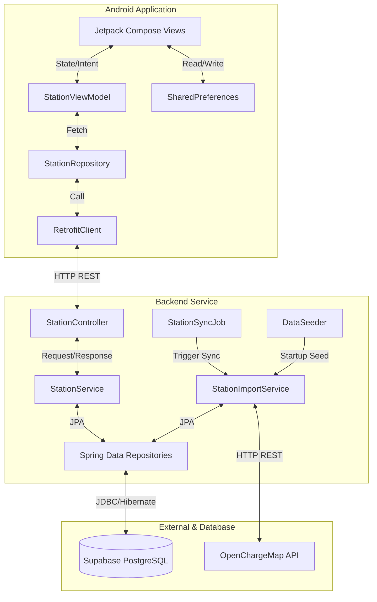

# 🔌 EV Station Finder

<div align="center">

[](https://github.com/singhaganesh/-EV-Station-Finder)
[](LICENSE)
[](backend/)
[](android/)
[](https://supabase.com)

## **Find EV Charging Stations. View Real-Time Slots. Get Charging. Done.**

Tired of struggling to locate nearby, operational charging points? **EV Station Finder** simplifies the process. 
Locate stations on an interactive map, inspect active connector details, verify slot availability, and filter by charger type — all in one seamless flow.

---

### 🚀 Quick Navigation
- **[👥 I'm Not a Developer — Show me the overview](#part-1---for-everyone-)**
- **[⚙️ I'm a Developer — Show me the setup](#part-2---for-developers-)**

</div>

---

# 👥 PART 1 — FOR EVERYONE 🌍

*No coding knowledge required. Read this section in ~5 minutes.*

## Table of Contents (Part 1)
1. [What Is This Project?](#what-is-this-project)
2. [The Problem We Solve](#the-problem-we-solve)
3. [How It Works](#how-it-works-simple-explanation)
4. [Key Benefits](#key-benefits)
5. [Who Is This For?](#who-is-this-for)
6. [Screenshots & Visuals](#screenshots--visuals)
7. [Frequently Asked Questions](#frequently-asked-questions-non-technical)
8. [What's Coming Next? (Roadmap)](#whats-coming-next-roadmap)

---

## What Is This Project?

EV Station Finder is a utility app that connects electric vehicle owners with a real-time directory of charging stations. By fetching live, verified data from OpenChargeMap (OCM), the app displays charging points on a map based on your location and offers detail sheets to show what charger types are available and if they are occupied.

With this app, you can:
- 🗺️ **Locate nearby EV charging stations** on an interactive map.
- ⚡ **Inspect connector configurations** (CCS2, Type 2, etc.) and power ratings (kW).
- 🟢 **Check charger availability** instantly.
- 🔍 **Search stations** by name or address.
- 🔖 **Bookmark favorite stations** for quick offline access.

---

## The Problem We Solve

### The Current Situation
*   **EV Drivers**: Spend too much time searching across multiple apps, guessing if chargers support their car's connector type, and arriving to find a station occupied, offline, or out of range.
*   **Fragmented Data**: Information about chargers is scattered or outdated, making trip planning stressful.

### Our Solution
We unified EV station directory information with:
*   **Real-time updates**: Synchronized periodically with global data.
*   **Intelligent viewports**: Only load what you need on the screen to save mobile data.
*   **Connector detail cards**: Tap a pin to see exact specs (e.g., CCS2, 60kW, Available).

---

## How It Works (Simple Explanation)

```
1. LOCATE ON MAP
   → App requests your GPS location and centers the map.
   → Pins drop representing charging stations.

2. EXPLORE VIEWPORT
   → As you drag the map, the app automatically fetches new stations.
   → The "Search this area" floating button lets you refresh on-demand.

3. INSPECT DETAILS
   → Tap a pin to reveal a detail sheet.
   → View the exact address, operating hours, rating, and prices.
   → See a list of charger slots indicating connector types (CCS2, Type 2) and availability.

4. BOOKMARK FAVOURITES
   → Tap the bookmark icon on any station to save it.
   → Access bookmarked stations from the "Saved" tab instantly.
```

---

## Key Benefits

### For EV Owners 🚗
*   **Say Goodbye to Range Anxiety**: Find a charging point quickly before your battery runs low.
*   **Connector Filtering**: Instantly verify if the charger supports your car's plug.
*   **Real-time Availability**: See how many slots are empty before driving there.
*   **Offline Access**: Bookmark stations so you can find them even in poor coverage areas.

---

## Who Is This For?

*   🚗 **EV Drivers**: Commuters and road-trippers looking for quick and reliable charger listings.
*   🔋 **Charging Network Operators**: Developers and administrators seeking a robust starter template to build customized station networks.

---

## Screenshots & Visuals

*Note: Visual placeholders represent live Android layouts.*

| Map View | Station Details | List & Filter View |
| :---: | :---: | :---: |
|  |  |  |
| *Interactive map showing nearby station pins.* | *Bottom sheet listing slots, speeds, and price.* | *Search and filter stations by name/connector.* |

---

## Frequently Asked Questions (Non-Technical)

### 🔒 Q: Does the app track my location in the background?
**A**: No. The app requests location access only while in use to display your position on the map and find adjacent stations.

### 📱 Q: Which operating systems are supported?
**A**: The mobile client is built for Android (version 8.0/API 26 and above).

### 🔋 Q: Where does the charger data come from?
**A**: Data is synchronized from **OpenChargeMap (OCM)**, the global public registry for electric vehicle charging locations.

### 📶 Q: Can I use the app without an internet connection?
**A**: You need an active internet connection to download the map tiles and request live station updates. However, your bookmarked (saved) stations are cached locally.

---

## What's Coming Next? (Roadmap)

| Feature | Description | Status |
| :--- | :--- | :--- |
| **Real-time Navigation** | Open Google Maps directions with a single tap | 📅 Planned |
| **Push Notifications** | Receive notifications when a bookmarked station becomes available | 💡 Under Review |
| **User Reviews** | Add comments and upload images of charging stations | 📅 Planned |
| **Route Planner** | Plan long-distance trips with recommended charging stops | 💡 Under Review |

---

# ⚙️ PART 2 — FOR DEVELOPERS 👨‍💻

*Complete technical documentation, architecture walkthrough, and development setup.*

## Table of Contents (Part 2)
1. [Technical Overview](#technical-overview)
2. [Tech Stack](#tech-stack)
3. [System Architecture](#system-architecture)
4. [Getting Started](#getting-started)
5. [API Documentation](#api-documentation)
6. [Folder & File Structure](#folder--file-structure)
7. [Configuration](#configuration)
8. [Testing](#testing)
9. [Deployment](#deployment)
10. [Security](#security)
11. [Performance & Scalability](#performance--scalability)
12. [Contributing](#contributing)

---

## Technical Overview

### Architecture Pattern: **Stateless REST Backend & MVVM Mobile Client**
The project splits cleanly into an Android App and a Spring Boot Backend:

*   **Spring Boot Backend**: Serves as a data aggregator, caching proxy, and business logic coordinator. It tracks charger slot availability, queries PostgreSQL with spatial bounding boxes, and pulls data from the OpenChargeMap API.
*   **Android Client**: Follows the **MVVM (Model-View-ViewModel)** design pattern. It uses Jetpack Compose for declarative UI rendering and Retrofit for asynchronous network interactions.

### Design Patterns Used
*   **MVC (Model-View-Controller)**: Spring Boot controllers handle routing and validate payloads.
*   **Repository Pattern**: Abstracted database access on the backend (via Spring Data JPA) and network access on the client.
*   **Observer Pattern**: Leverages Kotlin `StateFlow` to reactively update Compose layouts when the station list state changes.
*   **Debounce Pattern**: The Android map triggers queries only when the camera stops moving and the user has traveled more than 500 meters, protecting the backend from query floods.

---

## Tech Stack

### Backend
*   **Language & Runtime**: Java 21, Spring Boot 3.3.5
*   **Build Tool**: Maven
*   **Database & JPA**: PostgreSQL (Hosted on Supabase), Hibernate (ORM)
*   **Libraries**: Lombok (Boilerplate reduction), Jackson (JSON serialization)
*   **Client Communication**: Spring Web REST Controllers, RestTemplate

### Android Mobile Client
*   **Language**: Kotlin
*   **UI Framework**: Jetpack Compose (Declarative UI)
*   **Maps Engine**: Google Maps Compose SDK
*   **Networking**: Retrofit 2, OkHttp (HTTP Client)
*   **JSON Parsing**: Gson Converter
*   **Async & Concurrency**: Kotlin Coroutines & Flow
*   **Location Services**: Google Play Services Location (FusedLocationProviderClient)
*   **Local Storage**: Android SharedPreferences

---

## System Architecture

### Data Flow Diagram



### Complete Query Request Lifecycle (Android to Database)

```
1. MAP CAMERA POSITION CHANGE
   → User pans/zooms map in android app
   → MapTabScreen registers cameraState.isMoving == false
   → Calls StationViewModel.fetchNearbyStationsDebounced(LatLng, zoom)

2. DEBOUNCE FILTERING
   → ViewModel cancels previous search jobs
   → Waits 1.5s (debounce threshold)
   → Checks if coordinates moved > 500m from last fetched location
   → Calculates search radius (e.g., Zoom 12 = 15km)

3. API INITIATION
   → ViewModel triggers Retrofit client: GET /api/stations/nearby?lat=...&lng=...&radius=...
   → Request goes over HTTP to Spring Boot (port 8081)

4. BACKEND BUSINESS LOGIC
   → StationController handles getNearbyStations()
   → StationService calculates bounding box lat/lng deltas based on radius
   → Service calls StationRepository.findStationsInViewport(swLat, neLat, swLng, neLng)
   
5. DATABASE FETCHING & SCORING
   → PostgreSQL executes spatial bounding box query
   → StationService computes exact Haversine distance from user to each returned station
   → StationService queries ChargerSlotRepository for count & slot availability
   → Result is compiled into StationWithScore DTOs, sorted by distance, and returned

6. RENDER
   → Android App parses JSON response
   → ViewModel updates _uiState to StationUiState.Success(stations)
   → Compose updates MapTabScreen markers and ListScreen rows
```

---

## Getting Started

### Prerequisites

| Software | Minimum Version | Installation Link | Purpose |
| :--- | :--- | :--- | :--- |
| **Java JDK** | 21 | [OpenJDK 21](https://adoptium.net/) | Backend development runtime |
| **Maven** | 3.8.0 | [Maven Download](https://maven.apache.org/) | Backend build automation |
| **Android Studio** | Ladybug (or newer) | [Android Studio](https://developer.android.com/studio) | Mobile development IDE |
| **PostgreSQL** | 12 | [Postgres Download](https://www.postgresql.org/) | Local database (if not using cloud) |

Verify your environment variables with these commands:
```bash
# Verify Java version (must be 21+)
java -version

# Verify Maven version
mvn -version
```

---

### Repository Setup

Clone this repository and explore its two main directories:
```bash
git clone https://github.com/singhaganesh/-EV-Station-Finder.git
cd -EV-Station-Finder
```

---

### Database Setup

The backend connects to a PostgreSQL database. By default, it is configured for a **Supabase** instance, but you can run it on a local PostgreSQL server.

1.  Connect to your PostgreSQL client.
2.  Create a database:
    ```sql
    CREATE DATABASE ev_station_finder;
    ```
3.  The backend is configured with Hibernate DDL update (`spring.jpa.hibernate.ddl-auto=update`), meaning tables will be generated automatically on startup.

---

### Configuration & Run

#### 1. Start the Backend

1.  Navigate to the `backend` folder:
    ```bash
    cd backend
    ```
2.  Open `src/main/resources/application-dev.properties` and verify the datasource configuration:
    ```properties
    spring.datasource.url=jdbc:postgresql://<HOST>:<PORT>/postgres?sslmode=require
    spring.datasource.username=<USERNAME>
    spring.datasource.password=<PASSWORD>
    ```
    *(Alternatively, set the environment variables `FINDER_DB_URL`, `FINDER_DB_USERNAME`, and `FINDER_DB_PASSWORD` before launching).*
3.  Build and run the backend server:
    ```bash
    mvn clean install
    mvn spring-boot:run
    ```
    The backend will boot up on `http://localhost:8081`.

#### 2. Start the Android Client

1.  Open Android Studio.
2.  Select **Open an Existing Project** and choose the `android` folder from the repository.
3.  Wait for Gradle to sync dependencies.
4.  Configure the API Base URL:
    *   Open `android/app/src/main/java/com/ganesh/stationfinder/data/network/RetrofitClient.kt`.
    *   Change the `BASE_URL` to match your development system's local IP address:
        ```kotlin
        private const val BASE_URL = "http://<YOUR_PC_IP>:8081/"
        ```
        *Note: If running on an Android Emulator, use `http://10.0.2.2:8081/`.*
5.  Click the **Run** button (Green Arrow) in Android Studio to launch on your target emulator or physical device.

---

## API Documentation

The backend service hosts REST endpoints under the base prefix `/api`. 

### Core Endpoints

#### 1. Nearby Search
*   **Endpoint**: `GET /api/stations/nearby`
*   **Query Parameters**:
    *   `lat` (double, required): Latitude of search center
    *   `lng` (double, required): Longitude of search center
    *   `radius` (double, default=50): Search radius in kilometers
    *   `limit` (int, default=20): Max stations to return
*   **Sample Request**:
    ```bash
    curl -X GET "http://localhost:8081/api/stations/nearby?lat=19.0760&lng=72.8777&radius=15&limit=5"
    ```
*   **Sample Response**:
    ```json
    {
      "success": true,
      "message": "Found 1 nearby stations",
      "data": [
        {
          "id": 1,
          "name": "Tata Power Charging Station - Bandra",
          "latitude": 19.0596,
          "longitude": 72.8295,
          "address": "Bandra West, Mumbai, Maharashtra 400050",
          "operatingHours": "24 Hours",
          "pricePerKwh": 18.5,
          "rating": 4.5,
          "isOpen": true,
          "meta": "{\"source\":\"Offline Mock\"}",
          "distance": 5.34,
          "totalSlots": 3,
          "availableSlots": 2,
          "connectorTypes": ["CCS2", "Type 2"],
          "slots": [
            { "id": 1, "label": "CCS2 #1", "connectorType": "CCS2", "powerKw": 60.0, "isAvailable": true },
            { "id": 2, "label": "CCS2 #2", "connectorType": "CCS2", "powerKw": 60.0, "isAvailable": true },
            { "id": 3, "label": "Type 2 #1", "connectorType": "Type 2", "powerKw": 22.0, "isAvailable": false }
          ]
        }
      ]
    }
    ```

#### 2. Viewport Search
Used for loading pins dynamically while panning map screens.
*   **Endpoint**: `GET /api/stations/viewport`
*   **Query Parameters**: `neLat`, `neLng`, `swLat`, `swLng` (double, required bounding coordinates)
*   **Sample Response**:
    ```json
    {
      "success": true,
      "message": "Found 2 stations in viewport",
      "data": [
        { "id": 1, "name": "Tata Power Bandra", "latitude": 19.0596, "longitude": 72.8295, "available": true },
        { "id": 2, "name": "Ather Grid Lower Parel", "latitude": 18.9953, "longitude": 72.8257, "available": true }
      ]
    }
    ```

#### 3. Station Detail
*   **Endpoint**: `GET /api/stations/{id}/detail`
*   **Query Parameters**: `lat`, `lng` (double, required user coordinates to calculate dynamic distance)

#### 4. Text Search
*   **Endpoint**: `GET /api/stations/search`
*   **Query Parameters**: `q` (string, required query), `lat`, `lng` (double, required)

#### 5. Manual Sync Trigger
*   **Endpoint**: `POST /api/import/trigger`
*   **Query Parameters**: `lat`, `lng` (double, required), `radius` (int, default=100)

---

## Folder & File Structure

```
EV-Station-Finder/
│
├── backend/                                      # Spring Boot Backend Source
│   ├── src/main/java/com/ganesh/finder/
│   │   ├── FinderApplication.java                 # Spring Boot Main Entry Point
│   │   ├── StationImporterApp.java               # Standalone importer app
│   │   │
│   │   ├── config/
│   │   │   ├── DataSeeder.java                   # Seeds initial DB from OCM or mock data
│   │   │   └── StationSyncJob.java               # Cron Job that handles daily OCM fetches
│   │   │
│   │   ├── controller/
│   │   │   ├── ImportController.java             # Endpoints to trigger manual OCM imports
│   │   │   └── StationController.java            # Main API endpoint controllers
│   │   │
│   │   ├── service/
│   │   │   ├── StationService.java               # Bounding box & Haversine distance logic
│   │   │   └── StationImportService.java         # RestTemplate calls fetching data from OCM API
│   │   │
│   │   ├── repository/
│   │   │   ├── StationRepository.java            # JPA repository filtering by lat/lng viewport
│   │   │   └── ChargerSlotRepository.java        # JPA repository tracking slots availability
│   │   │
│   │   ├── model/
│   │   │   ├── Station.java                      # Station database entity
│   │   │   └── ChargerSlot.java                  # Charging slots database entity
│   │   │
│   │   └── dto/                                  # Data Transfer Objects (payload representations)
│   │       ├── ApiResponse.java
│   │       ├── StationMarker.java
│   │       └── StationWithScore.java
│   │
│   ├── src/main/resources/
│   │   ├── application.properties                # Base Spring Boot Configuration
│   │   └── application-dev.properties            # Dev profile configs (contains DB connection parameters)
│   └── pom.xml                                   # Backend dependencies
│
└── android/                                      # Kotlin Android Mobile Client
    ├── app/src/main/java/com/ganesh/stationfinder/
    │   ├── MainActivity.kt                       # Entry Activity. Location requester & Map viewport
    │   ├── StationViewModel.kt                   # UI state publisher, debounce timer
    │   ├── ListScreen.kt                         # Stations list layout with filter chips
    │   ├── SavedScreen.kt                        # Bookmarked stations panel
    │   ├── StationDetailsSheet.kt                # Station detail bottom overlay
    │   │
    │   ├── data/
    │   │   ├── model/
    │   │   │   └── OCMModels.kt                  # Serialized API data representations
    │   │   ├── network/
    │   │   │   ├── OpenChargeMapApi.kt           # Retrofit request signature definitions
    │   │   │   └── RetrofitClient.kt             # OkHttpClient configuration
    │   │   └── repository/
    │   │       └── StationRepository.kt          # Fetches stations via network Client
    │   │
    │   └── util/
    │       ├── LocationHelper.kt                 # Location permission resolver
    │       └── FavoriteManager.kt                # SharedPref wrapper handling bookmarks
    └── build.gradle.kts                          # Client app dependency configuration
```

---

## Configuration

### Backend: `application.properties`
*   `ocm.sync.enabled` (default `true`): Toggles whether the daily scheduler will run.
*   `ocm.sync.interval-cron` (default `0 0 3 * * ?`): Cron schedule configuration (runs daily at 3:00 AM).
*   `app.seeding.enabled` (default `false`): Toggle to trigger automatic import seeding on boot.

### Android Client: `RetrofitClient.kt`
*   Change the `BASE_URL` const:
    ```kotlin
    private const val BASE_URL = "http://<YOUR_LAN_IP>:8081/"
    ```

---

## Testing

### Backend
Execute unit and integration tests using Maven:
```bash
cd backend
mvn test
```

### Android Client
Run instrumental and local JUnit tests in Android Studio by right-clicking on `src/test` and selecting **Run Tests**.

---

## Deployment

### Manual Deployment (Production Server)
1.  **Package Backend JAR**:
    ```bash
    cd backend
    mvn clean package -DskipTests
    ```
    This generates a standalone executable JAR inside `backend/target/`.
2.  **Deploy System Service**:
    Create a Systemd file `/etc/systemd/system/ev-finder.service` on your production server:
    ```ini
    [Unit]
    Description=EV Station Finder Backend
    After=network.target

    [Service]
    User=ubuntu
    ExecStart=/usr/bin/java -jar /opt/ev-finder/backend.jar --spring.profiles.active=prod
    SuccessExitStatus=143
    Restart=always

    [Install]
    WantedBy=multi-user.target
    ```
3.  **Start Service**:
    ```bash
    sudo systemctl daemon-reload
    sudo systemctl start ev-finder
    sudo systemctl enable ev-finder
    ```

---

## Security

*   **Database Constraints**: The PostgreSQL schema utilizes parameterized queries through JPA to eliminate SQL injection vectors.
*   **CORS Policies**: Cross-Origin Resource Sharing is configured to allow connections from local and development origins.
*   **SSL Configuration**: Connection strings support `sslmode=require` configurations natively when linking backend jars to cloud Supabase PostgreSQL services.

---

## Performance & Scalability

*   **Map Camera Debounce**: The client-side debounce logic prevents spamming the backend database. While dragging the map, requests are deferred until the map stabilizes for 1.5 seconds.
*   **Spatial Viewport Bounding**: Viewport fetches look up stations using database indexes on the `latitude` and `longitude` fields, avoiding expensive table-scans.
*   **Dynamic Distances**: Heavy floating-point coordinate conversions (Haversine) are processed in parallel within Java streams using cached viewports.

---

## Contributing

1.  **Fork** the repository.
2.  Create your feature branch:
    ```bash
    git checkout -b feature/awesome-feature
    ```
3.  **Commit** changes with descriptive messages:
    ```bash
    git commit -m "feat: add Google Maps direction intent launch"
    ```
4.  **Push** to your fork:
    ```bash
    git push origin feature/awesome-feature
    ```
5.  Open a **Pull Request**.

---

## License

This project is licensed under the MIT License. See the [LICENSE](LICENSE) file for more information.
