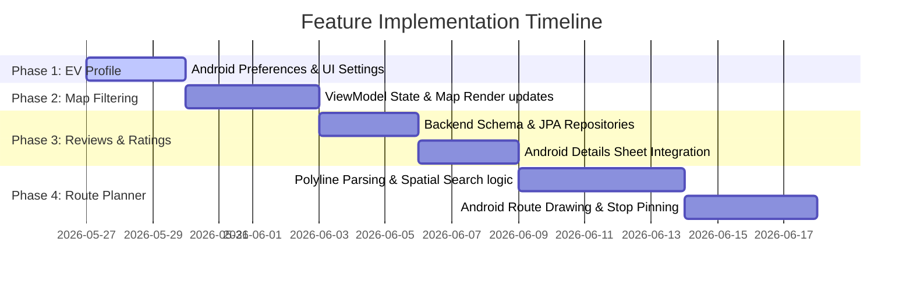

# EV Station Finder - Feature Expansion Implementation Plan

This document outlines the end-to-end technical implementation plan for expanding the EV Station Finder application. The proposed features are ordered logically by dependency, starting with client-side context setting and progressing to advanced spatial backend querying.

---

## 📅 Roadmap Overview



| Phase | Feature Name | Primary Layer | Key Rationale |
| :--- | :--- | :--- | :--- |
| **Phase 1** | **EV Profile & Connector Preference** | Android (Client) | Establishes the user context used to automate filtering in subsequent phases. |
| **Phase 2** | **Connector Type Filtering on Map** | Android (Client) | Consumes preferences from Phase 1 to color-code map markers. |
| **Phase 3** | **User Reviews & Ratings** | Backend & Android | A vertical slice introducing database schema updates and detail sheet extensions. |
| **Phase 4** | **Route Planner with Charging Stops** | Backend & Android | High-complexity feature relying on routing coordinates and spatial query logic. |

---

## ⚙️ Phase 1: EV Profile & Connector Preference

### 1. Goal & User Impact
Allows users to specify their vehicle type (`CAR` vs `TRUCK`) and default connector type (e.g., `CCS2`, `Type 2`). The app caches this setting to automatically filter map markers and route recommendations.

### 2. Android Client Changes
*   **Settings Preferences Store**: Extend [FavoriteManager.kt](file:///D:/Ganesh/work/EV-Station-Finder/android/app/src/main/java/com/ganesh/stationfinder/util/FavoriteManager.kt) to manage user preference keys:
    *   `KEY_PREF_CONNECTOR_TYPE` (String)
    *   `KEY_PREF_VEHICLE_TYPE` (String)
*   **UI Components**:
    *   Create a simple dialog or profile overlay (accessible via a gear icon on the top app bar in `MainActivity.kt`).
    *   Render selection options: A dropdown list of standard connectors (`CCS2`, `Type 2`, `CHAdeMO`) and radio buttons for `CAR` / `TRUCK`.
*   **ViewModel Sync**:
    *   Update `StationViewModel.kt` to read these preferences on initialization and apply them as default parameters for queries.

---

## 🗺️ Phase 2: Connector Type Filtering on the Map Tab

### 1. Goal & User Impact
Filters map pins reactively based on connector type selection. Compatible chargers will display standard green pins, whereas incompatible ones will render as gray/faded pins or be hidden entirely.

### 2. Android Client Changes
*   **Shared Filter State**: Update `StationViewModel.kt` to expose a state variable:
    ```kotlin
    private val _selectedConnectorFilter = MutableStateFlow<String?>(null)
    val selectedConnectorFilter: StateFlow<String?> = _selectedConnectorFilter.asStateFlow()
    ```
    On startup, default this to the value saved in Phase 1 profile preferences.
*   **Map Tab Interaction**:
    *   Expose a horizontal list of filter chips at the top of `MapTabScreen` in `MainActivity.kt` (similar to `ListScreen.kt`).
    *   When a chip is toggled, update `_selectedConnectorFilter` inside the ViewModel.
*   **Marker Customization**:
    *   In the Google Map Compose loop inside `MapTabScreen`, check if the station offers the selected connector type:
        ```kotlin
        val isCompatible = selectedConnector == null || station.connectorTypes.contains(selectedConnector)
        Marker(
            state = MarkerState(position = LatLng(station.latitude, station.longitude)),
            icon = if (isCompatible) BitmapDescriptorFactory.defaultMarker(BitmapDescriptorFactory.HUE_GREEN)
                   else BitmapDescriptorFactory.defaultMarker(BitmapDescriptorFactory.HUE_RED) // or grey icon
        )
        ```

---

## 💬 Phase 3: User Reviews and Ratings

### 1. Goal & User Impact
Enables community engagement by letting users read and submit ratings/reviews for charging stations. The backend dynamically aggregates reviews to update the station's global rating index.

### 2. Database Schema Updates
Add a new database table `reviews`:
```sql
CREATE TABLE reviews (
    id BIGSERIAL PRIMARY KEY,
    station_id BIGINT REFERENCES stations(id) ON DELETE CASCADE,
    reviewer_name VARCHAR(100) NOT NULL,
    rating DOUBLE PRECISION NOT NULL CHECK (rating >= 1.0 AND rating <= 5.0),
    comment TEXT,
    created_at TIMESTAMP DEFAULT NOW()
);

-- Index for fast retrieval per station
CREATE INDEX idx_reviews_station_id ON reviews(station_id);
```

### 3. Backend Changes
*   **Entity Definition**:
    *   Create a `Review.java` entity model in `com.ganesh.finder.model`.
*   **Repository Layer**:
    *   Create a `ReviewRepository.java` interface supporting standard page requests.
    *   Add query: `List<Review> findByStationIdOrderByCreatedAtDesc(Long stationId)`.
*   **Service Layer**:
    *   Write a method in `StationService.java` to compute average ratings and update the `rating` field on the corresponding `Station` entity when a new review is submitted.
*   **Controller Layer**:
    *   Add endpoints to [StationController.java](file:///D:/Ganesh/work/EV-Station-Finder/backend/src/main/java/com/ganesh/finder/controller/StationController.java):
        *   `GET /api/stations/{id}/reviews` - Retrieve reviews for a station.
        *   `POST /api/stations/{id}/reviews` - Submit a new review.

### 4. Android Client Changes
*   **Network Repository**:
    *   Declare Retrofit route in `OpenChargeMapApi.kt`.
*   **UI Details Panel Extension**:
    *   Update [StationDetailsSheet.kt](file:///D:/Ganesh/work/EV-Station-Finder/android/app/src/main/java/com/ganesh/stationfinder/StationDetailsSheet.kt) to load and render the feed of recent reviews.
    *   Include a "Write a Review" button opening a Compose dialog with a 5-star rating selector and comments text field.

---

## 🛣️ Phase 4: Route Planner with Charging Stops

### 1. Goal & User Impact
Enables long-distance route navigation. When a user queries a route (e.g., Delhi → Mumbai), the application queries stations located along the route path corridor, selecting only compatible options to suggest as charging stops.

### 2. Architectural Design: Polyline Corridor Search

```
           [Station A (12km away - Ignored)]
                 *
  ================= Corridor Boundary (10km) =================
   (Delhi) ------------------[Station B (3km away - Pin Drop)]------------------> (Mumbai)
  ================= Corridor Boundary (10km) =================
                 *
           [Station C (18km away - Ignored)]
```

The polyline search operates on a corridor principle:
1.  The Android client requests a route from a navigation provider (e.g., Google Directions API or OpenStreetMap).
2.  The route is represented as a list of coordinates (a Polyline string).
3.  The client transmits this polyline along with the desired connector type to the backend.
4.  The backend builds a coordinate corridor buffer and finds matching stations intersecting this path.

### 3. Backend Changes
*   **REST Endpoint**:
    *   Create `/api/route` in [StationController.java](file:///D:/Ganesh/work/EV-Station-Finder/backend/src/main/java/com/ganesh/finder/controller/StationController.java):
        *   Parameters: `waypoints` (Encoded polyline string or list of lat/lng pairs), `connectorType` (String), `bufferKm` (double, default = 10.0).
*   **Spatial Database Query (PostGIS option)**:
    If PostGIS is enabled on Supabase, the repository query is highly optimized:
    ```sql
    -- Converts the polyline text to geometry and finds stations within distance
    SELECT s.* FROM stations s 
    INNER JOIN charger_slots cs ON cs.station_id = s.id
    WHERE ST_DWithin(
        s.geom_location, 
        ST_GeomFromText(:polylineWkt, 4326), 
        :bufferRangeDegrees
    ) AND cs.connector_type = :connectorType;
    ```
*   **Alternative Core Java Corridor Search**:
    If running without spatial extensions, use cross-track distance calculations in `StationService.java`:
    1.  Parse the polyline into a list of segments: $P_1, P_2, \dots, P_n$.
    2.  For each station, calculate the perpendicular (cross-track) distance to each segment.
    3.  If distance $\le$ `bufferKm` and the station has compatible slots, include it in the response array.

### 4. Android Client Changes
*   **Route Input Panel**:
    *   Add a floating action button on the map tab for "Route Planner".
    *   Open input fields for **Start Location** and **Destination**.
*   **Path Drawing**:
    *   Fetch routing coordinates from a routing helper and draw the route line on the map using `Polyline`.
*   **Corridor Stop Pinning**:
    *   Send the polyline path to the backend route endpoint.
    *   Draw the returned station markers on top of the polyline on the map.

---

## 🧪 Verification & Testing Plan

### Automated Testing
*   **Backend unit tests**:
    *   Test `ReviewService` calculations: Verify station average rating updates accurately on new inserts.
    *   Test Polyline corridor search algorithm: Feed mock waypoints and assert only stations within the specified buffer metric are returned.
*   **Android Instrumental tests**:
    *   Assert SharedPreferences are updated when changing the EV profile settings dropdown.
    *   Verify map markers change colors or visibility states when changing filter chips.

### Manual Verification
1.  **Phase 1 & 2**:
    *   Set preference to `CCS2`. Save and check if the map displays green pins for CCS2 stations and red/grey for Type 2.
2.  **Phase 3**:
    *   Open details sheet for a station, write a review, check the DB update, and verify the average rating header changes dynamically.
3.  **Phase 4**:
    *   Simulate a route from Mumbai to Pune. Verify the app draws the route path and shows station stops along the Expressway corridor only.
