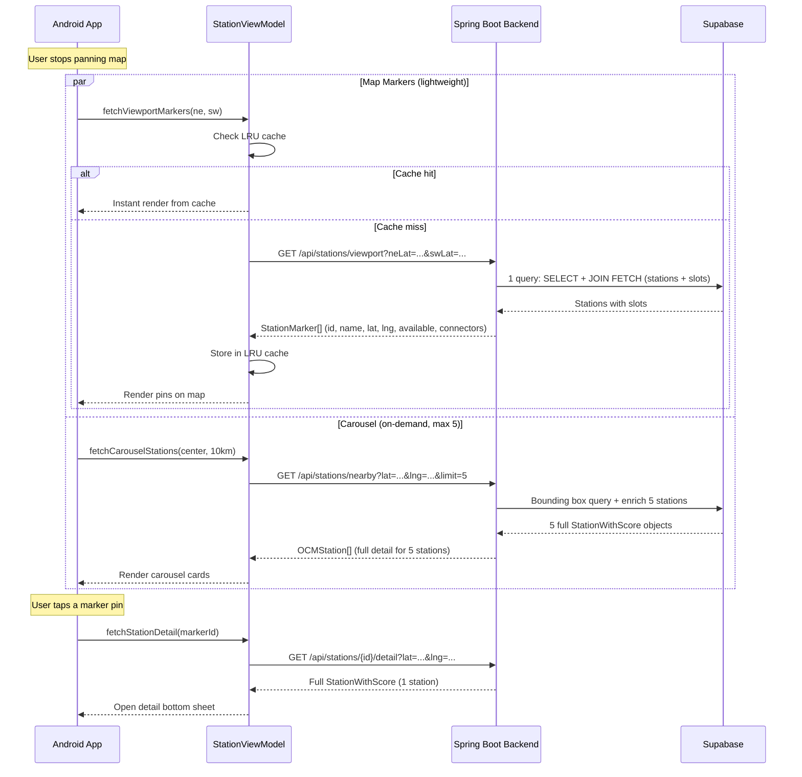

# Phase A Implementation Plan — Map UX Quick Wins

## Goal

Reduce the data payload per map interaction by **~6x**, eliminate the N+1 database query problem, cap viewport results at 200, and add client-side caching — all using mostly existing backend infrastructure.

---

## Current Problems Being Solved

| # | Problem | Root Cause | Fix |
|---|---------|-----------|-----|
| 1 | Heavy payload on every pan | `/nearby` returns full `StationWithScore` (slots, meta, address...) for map pins | Use lightweight `/viewport` endpoint for pins |
| 2 | N+1 DB queries | `getStationsInViewport()` calls `countByStationIdAndIsAvailableTrue()` per station | Single JOIN FETCH query |
| 3 | No result cap | Zooming to India fetches every station | Cap at 200, show "zoom in" toast |
| 4 | No caching | Every pan = fresh network call | In-memory LRU cache keyed by bounding box |

---

## Proposed Changes

### Backend

---

#### [MODIFY] [StationMarker.java](file:///D:/Ganesh/work/EV-Station-Finder/backend/src/main/java/com/ganesh/finder/dto/StationMarker.java)

Add `connectorTypes`, `rating`, `distance`, `availableSlots`, and `totalSlots` fields so the Android app can perform connector filtering and display the carousel without a second API call.

```diff
 public class StationMarker {
     private Long id;
     private String name;
     private Double latitude;
     private Double longitude;
     private Boolean available;
+    private Double rating;
+    private Double distance;
+    private Integer availableSlots;
+    private Integer totalSlots;
+    private List<String> connectorTypes;
 }
```

---

#### [MODIFY] [StationRepository.java](file:///D:/Ganesh/work/EV-Station-Finder/backend/src/main/java/com/ganesh/finder/repository/StationRepository.java)

Add a new query that **JOIN FETCH**es charger slots in a single database round-trip, and a count query for "too many" detection.

```diff
+    // Find stations with slots eagerly loaded (eliminates N+1)
+    @Query("SELECT DISTINCT s FROM Station s LEFT JOIN FETCH ChargerSlot cs ON cs.station = s " +
+           "WHERE s.latitude BETWEEN :swLat AND :neLat AND s.longitude BETWEEN :swLng AND :neLng")
+    List<Station> findStationsInViewportWithSlots(
+        @Param("swLat") double swLat,
+        @Param("neLat") double neLat,
+        @Param("swLng") double swLng,
+        @Param("neLng") double neLng
+    );
+
+    // Count stations in a viewport (for "too many" detection)
+    @Query("SELECT COUNT(s) FROM Station s WHERE s.latitude BETWEEN :swLat AND :neLat AND s.longitude BETWEEN :swLng AND :neLng")
+    long countStationsInViewport(
+        @Param("swLat") double swLat,
+        @Param("neLat") double neLat,
+        @Param("swLng") double swLng,
+        @Param("neLng") double neLng
+    );
```

---

#### [MODIFY] [StationService.java](file:///D:/Ganesh/work/EV-Station-Finder/backend/src/main/java/com/ganesh/finder/service/StationService.java)

Rewrite `getStationsInViewport()` to:
1. Use `findStationsInViewportWithSlots()` (single JOIN, no N+1)
2. Extract `connectorTypes` from the eagerly-loaded slots
3. Calculate `distance` from the viewport center
4. Cap results at 200 and return a `tooMany` flag

```java
public record ViewportResponse(List<StationMarker> markers, boolean tooMany) {}

public ViewportResponse getStationsInViewportOptimized(
        double neLat, double neLng, double swLat, double swLng) {

    double minLat = Math.min(swLat, neLat), maxLat = Math.max(swLat, neLat);
    double minLng = Math.min(swLng, neLng), maxLng = Math.max(swLng, neLng);

    long totalCount = stationRepository.countStationsInViewport(minLat, maxLat, minLng, maxLng);
    boolean tooMany = totalCount > 200;

    List<Station> stations = stationRepository.findStationsInViewportWithSlots(
            minLat, maxLat, minLng, maxLng);

    double centerLat = (minLat + maxLat) / 2.0;
    double centerLng = (minLng + maxLng) / 2.0;

    List<StationMarker> markers = stations.stream()
        .map(station -> {
            List<ChargerSlot> slots = chargerSlotRepository.findByStationId(station.getId());
            long availableCount = slots.stream().filter(ChargerSlot::getIsAvailable).count();
            List<String> connectorTypes = slots.stream()
                .map(ChargerSlot::getConnectorType).distinct().collect(Collectors.toList());
            double dist = calculateDistance(centerLat, centerLng,
                    station.getLatitude(), station.getLongitude());

            return StationMarker.builder()
                .id(station.getId())
                .name(station.getName())
                .latitude(station.getLatitude())
                .longitude(station.getLongitude())
                .available(availableCount > 0)
                .rating(station.getRating())
                .distance(dist)
                .availableSlots((int) availableCount)
                .totalSlots(slots.size())
                .connectorTypes(connectorTypes)
                .build();
        })
        .sorted(Comparator.comparingDouble(StationMarker::getDistance))
        .limit(200)
        .collect(Collectors.toList());

    return new ViewportResponse(markers, tooMany);
}
```

---

#### [MODIFY] [StationController.java](file:///D:/Ganesh/work/EV-Station-Finder/backend/src/main/java/com/ganesh/finder/controller/StationController.java)

Update the existing `/viewport` endpoint to use the optimized service method and return the `tooMany` flag in the response.

```diff
 @GetMapping("/viewport")
 public ResponseEntity<ApiResponse<?>> getStationsInViewport(
         @RequestParam double neLat,
         @RequestParam double neLng,
         @RequestParam double swLat,
         @RequestParam double swLng) {
     try {
-        List<StationMarker> markers = stationService.getStationsInViewport(neLat, neLng, swLat, swLng);
-        return ResponseEntity.ok(ApiResponse.success(
-                "Found " + markers.size() + " stations in viewport", markers));
+        var result = stationService.getStationsInViewportOptimized(neLat, neLng, swLat, swLng);
+        String msg = result.tooMany()
+            ? "Too many stations, showing nearest 200. Zoom in for more."
+            : "Found " + result.markers().size() + " stations in viewport";
+        return ResponseEntity.ok(ApiResponse.success(msg, result.markers()));
     } catch (Exception e) {
         return ResponseEntity.internalServerError()
                 .body(ApiResponse.error("Error: " + e.getMessage()));
     }
 }
```

---

### Android App

---

#### [MODIFY] [OCMModels.kt](file:///D:/Ganesh/work/EV-Station-Finder/android/app/src/main/java/com/ganesh/stationfinder/data/model/OCMModels.kt)

Add a new lightweight `StationMarker` data class for the viewport response. This is much smaller than the full `OCMStation`.

```kotlin
data class StationMarker(
    @SerializedName("id") val id: Long,
    @SerializedName("name") val name: String,
    @SerializedName("latitude") val latitude: Double,
    @SerializedName("longitude") val longitude: Double,
    @SerializedName("available") val available: Boolean,
    @SerializedName("rating") val rating: Double?,
    @SerializedName("distance") val distance: Double?,
    @SerializedName("availableSlots") val availableSlots: Int?,
    @SerializedName("totalSlots") val totalSlots: Int?,
    @SerializedName("connectorTypes") val connectorTypes: List<String>?
)
```

---

#### [MODIFY] [OpenChargeMapApi.kt](file:///D:/Ganesh/work/EV-Station-Finder/android/app/src/main/java/com/ganesh/stationfinder/data/network/OpenChargeMapApi.kt)

Add a new Retrofit endpoint for the viewport API.

```diff
+    @GET("api/stations/viewport")
+    suspend fun getStationsInViewport(
+        @Query("neLat") neLat: Double,
+        @Query("neLng") neLng: Double,
+        @Query("swLat") swLat: Double,
+        @Query("swLng") swLng: Double
+    ): ApiResponse<List<StationMarker>>
```

> [!NOTE]
> Import `StationMarker` from the model package.

---

#### [MODIFY] [StationRepository.kt](file:///D:/Ganesh/work/EV-Station-Finder/android/app/src/main/java/com/ganesh/stationfinder/data/repository/StationRepository.kt)

Add a new function to call the viewport endpoint.

```diff
+    suspend fun getStationsInViewport(
+        neLat: Double, neLng: Double, swLat: Double, swLng: Double
+    ): List<StationMarker> {
+        return try {
+            val response = api.getStationsInViewport(neLat, neLng, swLat, swLng)
+            if (response.success) response.data else emptyList()
+        } catch (e: Exception) {
+            android.util.Log.e("Repository", "Error fetching viewport markers", e)
+            emptyList()
+        }
+    }
```

---

#### [MODIFY] [StationViewModel.kt](file:///D:/Ganesh/work/EV-Station-Finder/android/app/src/main/java/com/ganesh/stationfinder/StationViewModel.kt)

This is the biggest change. We split map data into two separate state flows:

1. **`markerUiState`** — lightweight markers for map pins (from `/viewport`)
2. **`carouselStations`** — the nearest 5 full stations for the bottom carousel (from `/nearby` with `limit=5`)

Also add an in-memory bounding-box cache.

```kotlin
// New sealed state for markers
sealed class MarkerUiState {
    object Idle : MarkerUiState()
    object Loading : MarkerUiState()
    data class Success(val markers: List<StationMarker>, val tooMany: Boolean = false) : MarkerUiState()
    data class Error(val message: String) : MarkerUiState()
}

// Inside StationViewModel:

// --- Map markers (lightweight) ---
private val _markerState = MutableStateFlow<MarkerUiState>(MarkerUiState.Idle)
val markerState: StateFlow<MarkerUiState> = _markerState.asStateFlow()

// --- Carousel (full stations, max 5) ---
private val _carouselStations = MutableStateFlow<List<OCMStation>>(emptyList())
val carouselStations: StateFlow<List<OCMStation>> = _carouselStations.asStateFlow()

// --- Bounding box cache (LRU, max 10 entries) ---
private val viewportCache = LinkedHashMap<String, List<StationMarker>>(10, 0.75f, true)

private var lastViewportKey: String? = null
private var viewportJob: Job? = null
private var carouselJob: Job? = null

fun fetchViewportMarkers(neLat: Double, neLng: Double, swLat: Double, swLng: Double) {
    // Round to 3 decimal places for cache key (~111m precision)
    val key = "${(neLat*1000).toInt()},${(neLng*1000).toInt()},${(swLat*1000).toInt()},${(swLng*1000).toInt()}"

    // Skip if same viewport
    if (key == lastViewportKey) return
    lastViewportKey = key

    // Check cache
    viewportCache[key]?.let { cached ->
        _markerState.value = MarkerUiState.Success(cached)
        return
    }

    viewportJob?.cancel()
    viewportJob = viewModelScope.launch {
        delay(800) // debounce
        _markerState.value = MarkerUiState.Loading
        try {
            val markers = repository.getStationsInViewport(neLat, neLng, swLat, swLng)
            viewportCache[key] = markers
            if (viewportCache.size > 10) {
                viewportCache.remove(viewportCache.keys.first())
            }
            _markerState.value = MarkerUiState.Success(markers)
        } catch (e: Exception) {
            _markerState.value = MarkerUiState.Error(e.message ?: "Unknown error")
        }
    }
}

fun fetchCarouselStations(lat: Double, lng: Double, radius: Double = 10.0) {
    carouselJob?.cancel()
    carouselJob = viewModelScope.launch {
        delay(800) // debounce
        try {
            val stations = repository.getNearbyStations(lat, lng, radius)
            _carouselStations.value = stations.take(5)
        } catch (e: Exception) {
            _carouselStations.value = emptyList()
        }
    }
}
```

> [!IMPORTANT]
> The existing `uiState` / `fetchNearbyStations` / `fetchNearbyStationsDebounced` functions remain for backward compatibility with ListScreen and SavedScreen. Only `MapTabScreen` migrates to the new flows.

---

#### [MODIFY] [MainActivity.kt](file:///D:/Ganesh/work/EV-Station-Finder/android/app/src/main/java/com/ganesh/stationfinder/MainActivity.kt)

Update `MapTabScreen` to use the two new state flows:

**Map Markers** — Use `markerState` with lightweight `StationMarker`:
```kotlin
val markerState by viewModel.markerState.collectAsState()

// Inside GoogleMap { ... }
if (markerState is MarkerUiState.Success) {
    val markers = (markerState as MarkerUiState.Success).markers
    markers.forEach { marker ->
        val isCompatible = selectedConnector == null ||
            marker.connectorTypes?.contains(selectedConnector) == true
        Marker(
            state = MarkerState(position = LatLng(marker.latitude, marker.longitude)),
            title = marker.name,
            icon = BitmapDescriptorFactory.defaultMarker(
                if (isCompatible) BitmapDescriptorFactory.HUE_GREEN
                else BitmapDescriptorFactory.HUE_RED
            ),
            onClick = {
                // Fetch full detail on-demand when tapped
                viewModel.fetchStationDetail(marker.id, userLocation!!)
                true
            }
        )
    }
}
```

**Camera stop handler** — Call both viewport and carousel fetches:
```kotlin
LaunchedEffect(cameraPositionState.isMoving) {
    if (!cameraPositionState.isMoving) {
        val bounds = cameraPositionState.projection?.visibleRegion?.latLngBounds
        if (bounds != null) {
            viewModel.fetchViewportMarkers(
                bounds.northeast.latitude, bounds.northeast.longitude,
                bounds.southwest.latitude, bounds.southwest.longitude
            )
            val center = cameraPositionState.position.target
            viewModel.fetchCarouselStations(center.latitude, center.longitude)
        }
    }
}
```

**Carousel** — Use `carouselStations` (full OCMStation objects, max 5):
```kotlin
val carouselStations by viewModel.carouselStations.collectAsState()
val visibleRegion = cameraPositionState.projection?.visibleRegion
val visibleCarousel = if (visibleRegion != null) {
    carouselStations.filter { station ->
        visibleRegion.latLngBounds.contains(LatLng(station.latitude, station.longitude))
    }
} else carouselStations

if (visibleCarousel.isNotEmpty()) {
    NearbyStationsCarousel(
        stations = visibleCarousel,
        onStationClick = { ... },
        onNavigateClick = { ... },
        modifier = Modifier.align(Alignment.BottomCenter).padding(bottom = 24.dp)
    )
}
```

**"Too many stations" toast** — Show once when zoomed out:
```kotlin
LaunchedEffect(markerState) {
    if (markerState is MarkerUiState.Success) {
        val tooMany = (markerState as MarkerUiState.Success).tooMany
        if (tooMany) {
            Toast.makeText(context, "Showing nearest 200. Zoom in for more.", Toast.LENGTH_SHORT).show()
        }
    }
}
```

**Loading indicator** — Update to use `markerState`:
```kotlin
if (markerState is MarkerUiState.Loading && userLocation != null) {
    LinearProgressIndicator(
        modifier = Modifier.fillMaxWidth().align(Alignment.TopCenter),
        color = Color(0xFF0F766E)
    )
}
```

---

## Database Index (Recommended)

Add a composite index on `latitude` and `longitude`. Execute this SQL in Supabase SQL Editor:

```sql
CREATE INDEX IF NOT EXISTS idx_stations_lat_lng ON stations (latitude, longitude);
```

This turns the bounding-box `BETWEEN` query from a full table scan into an index range scan (~100x faster with 10K+ rows).

---

## Summary of Data Flow After Implementation



---

## Verification Plan

### Automated / Compiler Checks
```powershell
# Backend
cd backend
.\mvnw.cmd clean compile

# Android
cd android
.\gradlew.bat compileDebugSources
```

### Manual Verification
1. **Start backend** → `.\mvnw.cmd spring-boot:run`
2. **Launch Android app** on emulator
3. **Zoom in** (city level) → Verify markers load quickly, carousel shows ≤5 nearest stations
4. **Zoom out** (state/country level) → Verify max 200 markers appear, toast shows "Zoom in for more"
5. **Pan left, then pan back right** → Second load should be instant (cache hit)
6. **Tap a marker** → Verify detail sheet opens with full station info
7. **Filter by connector** → Verify both markers and carousel respect the filter
